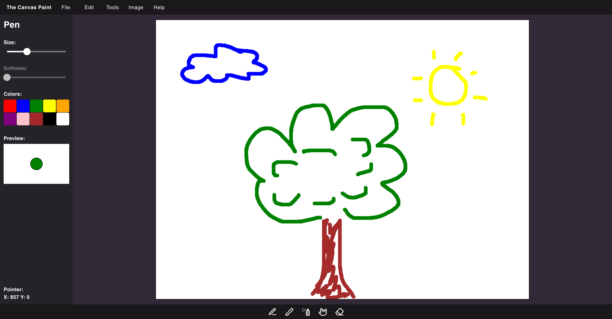

# The Canvas Paint

A simple canvas paint app.

## Purpose

To practice the usage of canvas HTML element, React, TypeScript, Material UI, and other technologies.

## Features

The current version of the app supports the following features:

- Drawing on the canvas
- Changing the tool: pen, brush, spray, blur, eraser
- Changing the tool's color
- Changing the tool's size
- Previewing the tool's size and color

## Demo

The live demo is available at [https://the-canvas-paint.vercel.app/](https://the-canvas-paint.vercel.app/).

## Screenshot

The Canvas Paint with a demo image 😎:

## Material Design

This app is designed according to the [Material Design](https://material.io/design) guidelines, but... it's not following them strictly.

The whole Material Design system provides a lot of components, not only atomic ones but also the most primitive ones like `Box,` `Stack,` and `Grid,` which is a regular `
` with some predefined display properties.

The application uses only atomic components (such as Buttons, Inputs, etc.) and some more complete which are not easy to implement from scratch (like ColorPicker or Menu). The primary scaffold is based on the native `div` elements and corresponding CSS styles.

## Used technologies

- 🎁 **Repository:** mono-repository by NX
- 🌈 **Framework:** react
- 🛠️ **Tools:** any specific tools at the moment
- 🎨 **Styling:** React Material UI, styled-components by emotion from MUI, lucide icons
- 💎 **Others:** desktop-first approach, canvas HTML element

## How to run

1. Install [Node.js](https://nodejs.org/en/download/).
2. Clone the repository.
3. Type and run: `npm i` in the root directory.
4. Type and run: `npm run dev` in the root directory.
5. Open `http://localhost:4200` in your browser to see the app.
